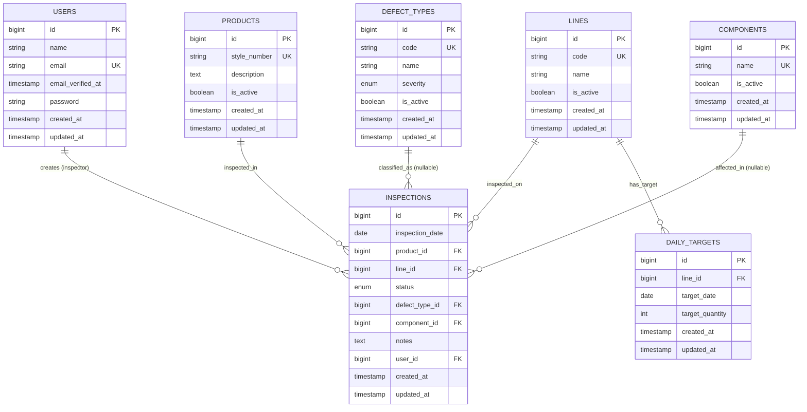

# 🗄️ DATABASE SCHEMA — QC Monitoring System

**Version**: 1.2
**Database**: `qc_monitoring`
**Engine**: MySQL 8.0+
**Charset**: utf8mb4_unicode_ci
**Last Updated**: 2026-05-20

---

## 📊 Entity Relationship Diagram (ERD)



> ℹ️ **Catatan**: Field `inspector_id` telah direname menjadi `user_id` pada migration `2026_05_13_000001`. Tidak ada tabel Spatie Permission (roles, permissions, pivot). RBAC belum diimplementasikan.

---

## 📋 Table Specifications

### 1. `users`

**Purpose**: Autentikasi dan manajemen inspector

| Column | Type | Null | Key | Description |
|--------|------|------|-----|-------------|
| `id` | BIGINT UNSIGNED | NO | PRI | Auto increment |
| `name` | VARCHAR(255) | NO | - | Nama lengkap inspector |
| `email` | VARCHAR(255) | NO | UNI | Email login (unique) |
| `email_verified_at` | TIMESTAMP | YES | - | Waktu verifikasi email |
| `password` | VARCHAR(255) | NO | - | Bcrypt hash |
| `remember_token` | VARCHAR(100) | YES | - | Session token |
| `created_at` | TIMESTAMP | YES | - | Dibuat |
| `updated_at` | TIMESTAMP | YES | - | Diperbarui |

**Business Rules**:
- Email harus unik
- Password min 8 karakter (enforced Filament)
- Tidak bisa dihapus jika punya record inspeksi

---

### 2. `products`

**Purpose**: Master data produk (style numbers)

| Column | Type | Null | Key | Description |
|--------|------|------|-----|-------------|
| `id` | BIGINT UNSIGNED | NO | PRI | Auto increment |
| `style_number` | VARCHAR(100) | NO | UNI | Kode produk unik |
| `description` | TEXT | YES | - | Deskripsi produk |
| `is_active` | TINYINT(1) | NO | MUL | Default: 1 (aktif) |
| `created_at` | TIMESTAMP | YES | - | - |
| `updated_at` | TIMESTAMP | YES | - | - |

**Business Rules**:
- `style_number` tidak bisa diubah setelah ada inspeksi
- Hanya produk aktif yang tampil di form inspeksi

---

### 3. `lines`

**Purpose**: Master data production line

| Column | Type | Null | Key | Description |
|--------|------|------|-----|-------------|
| `id` | BIGINT UNSIGNED | NO | PRI | Auto increment |
| `code` | VARCHAR(50) | NO | UNI | Kode line (e.g. LINE-A) |
| `name` | VARCHAR(255) | NO | - | Nama tampilan |
| `is_active` | TINYINT(1) | NO | MUL | Default: 1 |
| `created_at` | TIMESTAMP | YES | - | - |
| `updated_at` | TIMESTAMP | YES | - | - |

**Business Rules**:
- Kode harus unik dan uppercase
- Cascade delete ke `daily_targets` jika line dihapus

---

### 4. `defect_types`

**Purpose**: Klasifikasi dan tingkat keparahan defect

| Column | Type | Null | Key | Description |
|--------|------|------|-----|-------------|
| `id` | BIGINT UNSIGNED | NO | PRI | Auto increment |
| `code` | VARCHAR(50) | NO | UNI | Kode defect |
| `name` | VARCHAR(255) | NO | MUL | Nama defect |
| `severity` | ENUM | NO | MUL | `low`, `medium`, `high`, `critical` |
| `is_active` | TINYINT(1) | NO | MUL | Default: 1 |
| `created_at` | TIMESTAMP | YES | - | - |
| `updated_at` | TIMESTAMP | YES | - | - |

**Severity Levels**:

| Level | Warna | Contoh |
|-------|-------|--------|
| `low` | 🟢 | Benang longgar |
| `medium` | 🟡 | Noda kecil |
| `high` | 🟠 | Resleting rusak |
| `critical` | 🔴 | Produk tidak bisa dipakai |

---

### 5. `components`

**Purpose**: Master komponen produk

| Column | Type | Null | Key | Description |
|--------|------|------|-----|-------------|
| `id` | BIGINT UNSIGNED | NO | PRI | Auto increment |
| `name` | VARCHAR(255) | NO | UNI | Nama komponen |
| `is_active` | TINYINT(1) | NO | MUL | Default: 1 |
| `created_at` | TIMESTAMP | YES | - | - |
| `updated_at` | TIMESTAMP | YES | - | - |

Contoh: Sleeve, Collar, Button, Zipper, Pocket

---

### 6. `daily_targets`

**Purpose**: Target inspeksi harian per line

| Column | Type | Null | Key | Description |
|--------|------|------|-----|-------------|
| `id` | BIGINT UNSIGNED | NO | PRI | Auto increment |
| `line_id` | BIGINT UNSIGNED | NO | MUL | FK → lines.id |
| `target_date` | DATE | NO | MUL | Tanggal target |
| `target_quantity` | INT UNSIGNED | NO | - | Jumlah target (>0) |
| `created_at` | TIMESTAMP | YES | - | - |
| `updated_at` | TIMESTAMP | YES | - | - |

**Business Rules**:
- Unique constraint: satu target per line per tanggal
- `target_quantity` harus > 0
- Cascade delete jika line dihapus

---

### 7. `inspections` ⭐ (Core Table)

**Purpose**: Rekaman transaksi inspeksi kualitas

| Column | Type | Null | Key | Description |
|--------|------|------|-----|-------------|
| `id` | BIGINT UNSIGNED | NO | PRI | Auto increment |
| `inspection_date` | DATE | NO | MUL | Tanggal inspeksi |
| `product_id` | BIGINT UNSIGNED | NO | MUL | FK → products.id |
| `line_id` | BIGINT UNSIGNED | NO | MUL | FK → lines.id |
| `status` | ENUM | NO | MUL | `pass` / `reject` |
| `defect_type_id` | BIGINT UNSIGNED | YES | MUL | FK → defect_types.id (nullable) |
| `component_id` | BIGINT UNSIGNED | YES | MUL | FK → components.id (nullable) |
| `notes` | TEXT | YES | - | Catatan admin |
| `user_id` | BIGINT UNSIGNED | NO | MUL | FK → users.id (direname dari `inspector_id`) |
| `created_at` | TIMESTAMP | YES | MUL | - |
| `updated_at` | TIMESTAMP | YES | - | - |

**Indexes (14 total)**:

```sql
PRIMARY KEY (id)

-- Foreign keys
INDEX idx_product_id (product_id)
INDEX idx_line_id (line_id)
INDEX idx_defect_type_id (defect_type_id)
INDEX idx_component_id (component_id)
INDEX idx_user_id (user_id)    -- direname dari idx_inspector_id

-- Performance indexes
INDEX idx_inspection_date (inspection_date)
INDEX idx_status (status)
INDEX idx_created_at (created_at)

-- Composite indexes (CRITICAL untuk dashboard)
INDEX idx_status_date (status, inspection_date)
INDEX idx_line_date (line_id, inspection_date)
```

**Business Rules**:
1. `status = 'pass'` → `defect_type_id` dan `component_id` harus NULL
2. `status = 'reject'` → `defect_type_id` WAJIB diisi
3. `inspection_date` tidak boleh tanggal masa depan
4. `user_id` otomatis dari user (admin) yang sedang login

**ON DELETE Policies**:

| Parent | ON DELETE | Alasan |
|--------|-----------|--------|
| `products` | RESTRICT | Jaga data historis |
| `lines` | RESTRICT | Jaga data historis |
| `users` | RESTRICT | Jaga data admin |
| `defect_types` | SET NULL | Keep inspeksi, hilangkan klasifikasi |
| `components` | SET NULL | Keep inspeksi, hilangkan komponen |

---

## 🔗 Relationship Overview

```
users (1) ──────► (N) inspections

products (1) ───► (N) inspections

lines (1) ──────► (N) inspections
lines (1) ──────► (N) daily_targets

defect_types (1) ► (N) inspections [nullable]
components (1) ──► (N) inspections [nullable]
```

---

## 📈 Query Patterns & Index Usage

### Dashboard Stats (Paling Sering)

```sql
SELECT COUNT(*) FROM inspections
WHERE inspection_date = CURDATE() AND status = 'pass';
-- Index: idx_status_date → ~5ms
```

### Line Performance Report

```sql
SELECT COUNT(*) FROM inspections
WHERE line_id = 1
AND inspection_date BETWEEN '2026-02-01' AND '2026-02-28';
-- Index: idx_line_date → ~8ms
```

### Top Defects Chart

```sql
SELECT defect_type_id, COUNT(*) as count
FROM inspections
WHERE status = 'reject'
AND inspection_date >= DATE_SUB(CURDATE(), INTERVAL 7 DAY)
GROUP BY defect_type_id
ORDER BY count DESC LIMIT 5;
-- Index: idx_status_date + idx_defect_type_id → ~12ms
```

---

## 💾 Storage Estimation

| Tahun | Inspeksi | Estimasi DB |
|-------|----------|-------------|
| Y1 | 600.000 | ~150 MB |
| Y2 | 1.200.000 | ~300 MB |
| Y3 | 1.800.000 | ~450 MB |
| Y5 | 3.000.000 | ~750 MB |

> Sangat manageable — tidak perlu partisi untuk 5+ tahun.

---

## 🔄 Migration History

| Versi | Tanggal | File |
|-------|---------|------|
| 1.0.0 | 2026-02-05 | Initial schema (users, products, lines, defect_types, components, daily_targets, inspections) |
| 1.1.0 | 2026-02-05 | Performance indexes (`add_performance_indexes_to_tables`) |
| 1.2.0 | 2026-05-13 | Rename `inspector_id` → `user_id`, tambah `approved_by`, `approved_at` di `inspections` |

---

## ✅ Schema Checklist

- [x] Semua tabel punya primary key
- [x] Semua foreign key punya index
- [x] Semua kolom date punya index
- [x] Composite index untuk query umum
- [x] Unique constraint untuk business rules
- [x] ON DELETE policy terdefinisi
- [x] Default value tepat
- [x] ENUM field dengan nilai valid
- [x] Timestamps di semua tabel

---

**Total Tabel**: 7
**Total Indexes**: 25+
**Total Foreign Keys**: 6
**Status**: ✅ Production Ready
